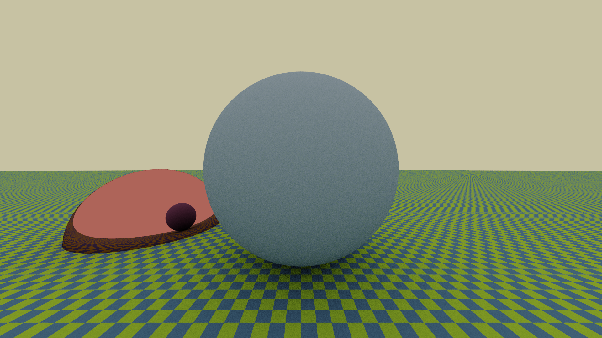
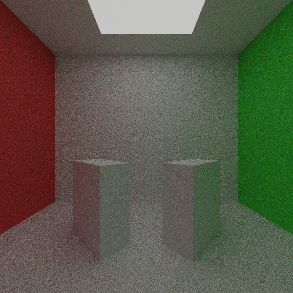

# 5K JFS

Welcome to 5K JFS, the future of pictures. This is a simple raytracer, written in C# and developed for the course _Numerical Methods for Photorealistic Image Generation_ held by professor [Maurizio Tomasi][1] at the University of Milan, Physics Department (Academic Year 2021-2022).

The contibutors to the project are [Simone Boscolo][2], [Gabriele Crespi][3] and [Matteo Macchini][4].

## Table of Contents

- [Requirements](#requirements)
- [Usage](#usage)
    - [Render mode](#render-mode-)
    - [Demo mode](#demo-mode-)
    - [Convert mode](#convert-mode-)
- [Gallery](#gallery)
- [Contributing](#contributing)
- [History](#history)
- [License](#license)

## Requirements

5K JFS requires [.NET 6.0.x](https://dotnet.microsoft.com/en-us/download/dotnet/6.0) to run; older versions of .NET will not work. To develop our code the following external libraries have been used:

- [ImageSharp](https://www.nuget.org/packages/SixLabors.ImageSharp/2.1.1) to convert a pfm image into an LDR image
- [CommandLineUtils](https://www.nuget.org/packages/Microsoft.Extensions.CommandLineUtils) to build the Comman Line Interface
- [NetCore.Platforms](https://www.nuget.org/packages/Microsoft.NETCore.Platforms/7.0.0-preview.3.22175.4)
- [ShellProgressBar](https://www.nuget.org/packages/ShellProgressBar/) to show a progress bar during while rendering
 
The user should not worry about them, since they will be installed automatically when the repository is downloaded.

This library is available for Windows, Linux and MacOS systems.

## Usage

In order to use the library you can clone this repository through the command

    git clone git@github.com:simoneboscolo99/5K_JFS.git
    
Alternatively, you can download the latest version of the code from the [releases page](https://github.com/simoneboscolo99/5K_JFS/releases).

To check that the code works as expected, you can run the suite of tests using the following command:

    dotnet test

To get command line help for the usage, simply run

    dotnet run

### Render mode 🌄

You can create your own images throug this mode: it reads an input file describing the scene to render and then creates the image, using ray tracing. [Here][5] you can easily learn how to write an input file.  
In order to use the render mode, you can go to the `5K_JFS/5K_JFS` directory and run the following command

    dotnet run -- render [arguments] [options]
    
The only required argument for the render command is the path of the input file describing the scene. [Here](https://github.com/simoneboscolo99/5K_JFS/tree/readme/5K_JFS/Examples) you can take a look at some examples  of input files.  
Feel free to explore all the possible options and to use the most suitable for you
    
    dotnet run -- render -?
    
All available shapes are explaind in details in the input file [tutorial][5].    

### Demo mode 👿

To run the application and visualize a simple image, use the following command

    dotnet run -- demo [options]
   
To view all the possible options you can run
    
    dotnet run -- demo -?
    
It is also possible to vary the angle of the camera (option -a) in order to obtain an animation like the one shown. For further informations see this file. In order to create the animation [ffmpeg](https://ffmpeg.org) must be installed.

### Convert mode 🔄

If you are looking for a way to convert a `.pfm` file into an LDR file this is the mode for you. Just run the command

    dotnet run -- convert -i <INPUT_FILENAME> -o <OUTPUT_FILENAME>  
    
Available formats of the output file are: `.png`, `.jpg`, `.gif`, `.bmp` or `.pbm`.  
To view all the possible options you can run
    
    dotnet run -- convert -?
    
## Gallery

 

  

 

## Contributing

To contribute to 5K JFS, clone this repo locally and commit your code on a separate branch. Please write unit tests for your code and then open a *pull request*. If you find any bug in our code, let us know by opening an *issue*. We will be grateful to any contribution!

## History
See the file [CHANGELOG.md](./CHANGELOG.md).

## License
The code is released under GNU General Public License. See the file [LICENSE](./LICENSE) for further informations.

[1]: https://github.com/ziotom78
[2]: https://github.com/simoneboscolo99
[3]: https://github.com/GabrieleCrespi
[4]: https://github.com/MatteoMacchini
[5]: https://github.com/simoneboscolo99/5K_JFS/blob/readme/5K_JFS/Examples/Tutorial.md
